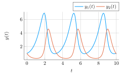
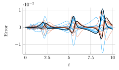

# Calibrated Adaptive Probabilistic ODE Solvers - Code

<p>
  
  
</p>

This repo contains the code which was used to compute the results of the paper "Calibrated Adaptive Probabilistic ODE Solvers", currently published in
[arXiv](https://arxiv.org/abs/2012.08202).


---

__To solve differential equations in Julia with probabilistic numerical solvers, please use
[ODEFilters.jl](https://github.com/nathanaelbosch/ODEFilters.jl)!__<br />
The code in this repository is not meant to be used as generic ODE solvers, whereas
[ODEFilters.jl](https://github.com/nathanaelbosch/ODEFilters.jl)
is a Julia package under active development.
It is more stable and documented, its solvers are more efficent, and it contains more features.
The DE solvers it provides are compatible with the
[DifferentialEquations.jl](https://docs.sciml.ai/stable/)
ecosystem.

---

A __Python__ implementation of these solvers, as well as of additional probabilistic numerical methods, is maintained in [ProbNum](https://github.com/probabilistic-numerics/probnum).


## Usage
The experiments can be found in `./experiments`, and the actual solvers are implemented in `./src`.
To start, open a Julia console with `julia --project=.`.
You can then run the experiments with, e.g., `include(experiments/1 Stiff Van der Pol/main.jl)`.


## Reference
```
@misc{bosch2020calibrated,
      title={Calibrated Adaptive Probabilistic ODE Solvers},
      author={Nathanael Bosch and Philipp Hennig and Filip Tronarp},
      year={2020},
      eprint={2012.08202},
      archivePrefix={arXiv},
      primaryClass={math.NA}
}
```
